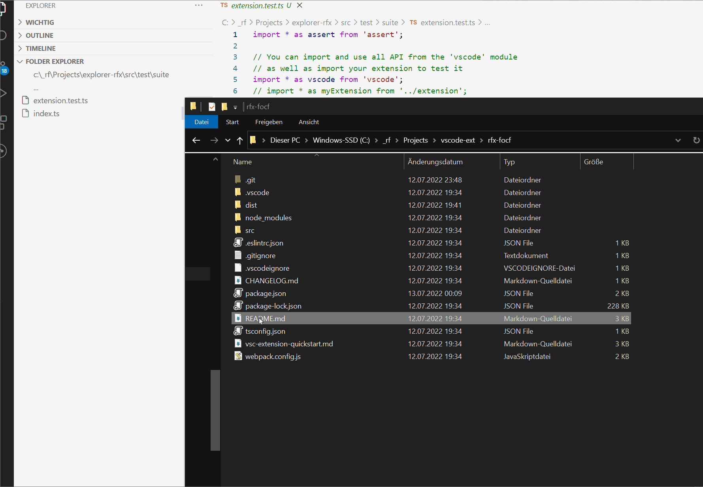

# Folder Explorer

This is the Folder Explorer.
A trial to become fast for use cases without "workspaces" in vscode.

## Features

Comparable to Notepad++ Explorer Plugin, you get an additional vscode
Explorer "View" -> Folder Explorer.

> Open via "View" -> "Open View" -> "Folder Explorer"

Which is simple and fast.

It has a button to open folder of current file in editor.
You can navigate folders up or expand containing folders.
And open other files with a single click.

### QuickPickFile

For me big C-Projects have the tendency to kill vscode tag parser.
Hence I prefer working "without workspace" so that at least tag parser works on "single file base".

Resulting I have added two commands:
- **QuickPickFile**: allows to select a file from specified directories and open it quickly.  
                  (alternative for 'Go to File' which requires a workspace)  
    **note** : not automatically bound to any keyboard shortcut. But I would recommend to assign it to a favorable shortcut (i personally prefer Ctrl+L = go to Location).                 
- **QuickPickRefresh**: refreshes the underlying file dictionary based on given directories  
    **note** : not automatically bound to any keyboard shortcut.
     Refresh usually invoked via "command execution" (default: Ctrl+Shift+P).
     There is no automatic timed refresh or file system watcher
     (keep extension low profile)

To realize the feature these configurations were added and can be specified in **settings.json**.
- **quickpickfile.dirs** : array of directories to search for files (recursively)
- **quickpickfile.ignoredirs** : array of patterns to skip directories if containing pattern
- **quickpickfile.ignorefileexts** : array of file extensions to skip file for index if having this extension
    with dots and by intension case-sensitive

## Requirements

- no external dependencies

## Extension Settings

No settings, yet.

## Known Issues

none
## Release Notes

### 0.1.0

Initial release

